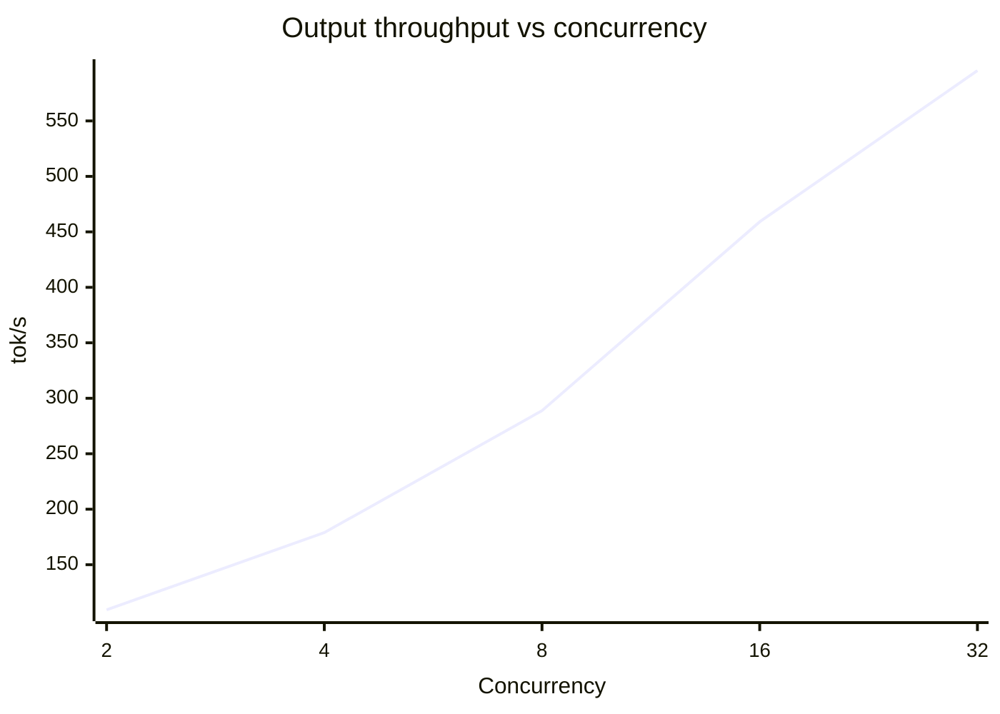

<!-- 
Benchmark Report Generated: 2025-12-14T23:11:51.889338
Model: cyankiwi/Devstral-Small-2-24B-Instruct-2512-AWQ-4bit
Hardware: 4× AMD Instinct MI100 (gfx908)
Generated by: benchmark_and_report.py
Note: This report was written by the model being benchmarked.
-->

# LLM Inference Benchmark Report

**Model:** cyankiwi/Devstral-Small-2-24B-Instruct-2512-AWQ-4bit

**Hardware:** 4× AMD Instinct MI100 (gfx908)

**Date:** December 14, 2025

## Executive Summary

This benchmark report evaluates the interactive UX and throughput performance of cyankiwi/Devstral-Small-2-24B-Instruct-2512-AWQ-4bit on a 4× AMD Instinct MI100 system. The interactive sweet spot is at c=4 concurrency, delivering a balanced TTFT/TPOT p99 with 44.7 tok/s per-user throughput, ideal for responsive UX. Peak throughput scales to 595.37 tok/s at c=32, while the best TPOT of 16.67 ms is observed in the Decode Stress Test.

## System Configuration

| Component | Value |
|---|---|
| GPU(s) | 4× AMD Instinct MI100 (gfx908) |
| OS | Ubuntu 22.04.5 LTS |
| Kernel | 6.8.0-87-generic |
| CPU | AMD Ryzen Threadripper PRO 3945WX 12-Cores |
| System RAM | 251.6 GB |
| ROCk Module Version | 6.16.6 |
| ROCm | 7.1.0 |
| xGMI | Present (hive_id 0xb868aeba19fb5cee) |

## Performance Summary

| Scenario | Category | Input (tok) | Output (tok) | Concurrency | Output Throughput (tok/s) | TTFT mean (ms) | TPOT mean (ms) | TPOT p99 (ms) |
|---|---:|---:|---:|---:|---:|---:|---:|---:|
| Single User Latency | Latency | 2048 | 512 | 1 | 56.02 | 421.16 | 17.06 | 17.14 |
| Short Context Throughput | Throughput | 512 | 256 | 16 | 346.19 | 1309.14 | 36.36 | 46.25 |
| Long Context (16K) | Long Context | 16384 | 1024 | 4 | 65.30 | 12212.42 | 44.75 | 52.35 |
| Decode Stress Test | Decode | 128 | 2048 | 1 | 59.94 | 37.05 | 16.67 | 16.69 |
| Mixed Traffic | Mixed | 2048 | 512 | 8 | 172.51 | 1987.13 | 40.67 | 59.62 |
| Concurrency Scaling (c=2) | Concurrency Scaling | 1024 | 256 | 2 | 109.30 | 201.60 | 17.58 | 18.58 |
| Concurrency Scaling (c=4) | Concurrency Scaling | 1024 | 256 | 4 | 178.90 | 106.02 | 20.85 | 21.38 |
| Concurrency Scaling (c=8) | Concurrency Scaling | 1024 | 256 | 8 | 288.85 | 149.35 | 25.51 | 26.03 |
| Concurrency Scaling (c=16) | Concurrency Scaling | 1024 | 256 | 16 | 459.05 | 220.19 | 31.92 | 32.48 |
| Concurrency Scaling (c=32) | Concurrency Scaling | 1024 | 256 | 32 | 595.37 | 388.10 | 49.00 | 49.79 |

## Prefill (PP) and Decode (TG)

| Scenario | Prefill (PP) tok/s | Token Generation (TG) tok/s |
|---|---:|---:|
| Single User Latency | 4862.8 | 58.6 |
| Short Context Throughput | 391.1 | 27.5 |
| Long Context (16K) | 1341.6 | 22.3 |
| Decode Stress Test | 3454.8 | 60.0 |
| Mixed Traffic | 1030.6 | 24.6 |
| Concurrency Scaling (c=2) | 5079.4 | 56.9 |
| Concurrency Scaling (c=4) | 9658.6 | 48.0 |
| Concurrency Scaling (c=8) | 6856.4 | 39.2 |
| Concurrency Scaling (c=16) | 4650.5 | 31.3 |
| Concurrency Scaling (c=32) | 2638.5 | 20.4 |

## Concurrency Scaling

**Interactive sweet spot:** c=4 (interactive-optimal by TTFT/TPOT p99; per-user 44.7 tok/s)

**Peak throughput (scaling):** c=32 (595.4 tok/s)

| Concurrency | Output Throughput (tok/s) | Per-user Throughput (tok/s) | TTFT p99 (ms) | TPOT p99 (ms) |
|---:|---:|---:|---:|---:|
| 2 | 109.30 | 54.65 | 634.25 | 18.58 |
| 4 | 178.90 | 44.73 | 139.96 | 21.38 |
| 8 | 288.85 | 36.11 | 178.92 | 26.03 |
| 16 | 459.05 | 28.69 | 247.08 | 32.48 |
| 32 | 595.37 | 18.61 | 446.41 | 49.79 |

## Scenario Results

### Single User Latency
**Purpose:** Best-case latency with no batching
**Key metrics:**
- Input/Output: 2048 / 512 tokens
- Concurrency: 1
- Prompts: 20
- Output throughput: 56.02 tok/s (peak 60.00)
- TTFT mean/median/p99: 421.16 / 47.44 / 1118.50 ms
- TPOT mean/median/p99: 17.06 / 17.05 / 17.14 ms
- PP/TG (derived): 4862.8 / 58.6 tok/s

---

**Interpretation:**

- TTFT mean/median/p99 of 421.16/47.44/1118.50 ms shows high variability in prefill time, with the p99 significantly higher than the mean, indicating tail latency issues that could degrade interactive user experience.
- TPOT mean/median/p99 of 17.06/17.05/17.14 ms shows stable and consistent token generation speed, suggesting efficient decoding despite variability in prefill.
- Output throughput of 56.02 tok/s is lower than the derived decode speed of 58.6 tok/s, suggesting slight overhead or inefficiency in token generation.
- The peak output throughput of 60.00 tok/s is close to the derived decode speed, indicating that the system is operating near its theoretical maximum for token generation.
- Total token throughput of 280.00 tok/s is much higher than the output throughput, suggesting that the system is primarily limited by the decoding speed rather than the prefill speed.
- The derived prefill speed of 4862.8 tok/s is significantly higher than the derived decode speed, reinforcing that the bottleneck is in the decoding phase.
- The ITL mean/median/p99 of 17.06/17.00/17.87 ms aligns with TPOT, indicating that the system's performance is stable under the given conditions, but the high TTFT p99 suggests potential issues with tail latency.

### Short Context Throughput
**Purpose:** Maximum throughput with short sequences
**Key metrics:**
- Input/Output: 512 / 256 tokens
- Concurrency: 16
- Prompts: 50
- Output throughput: 346.19 tok/s (peak 528.00)
- TTFT mean/median/p99: 1309.14 / 1166.51 / 3383.58 ms
- TPOT mean/median/p99: 36.36 / 39.14 / 46.25 ms
- PP/TG (derived): 391.1 / 27.5 tok/s

---

**Interpretation:**

- High TTFT (1.3s mean) suggests significant queueing or prefill overhead even with short sequences, hurting interactive responsiveness.
- Low TPOT (36ms mean) indicates efficient decode, but p99/mean gap of ~10ms shows minor tail latency.
- Peak throughput (528 tok/s) far exceeds sustained (346 tok/s), pointing to underutilized hardware capacity.
- Prefill speed (391 tok/s) is higher than decode (27.5 tok/s), though decode is the bottleneck for output generation.
- ITL closely matches TPOT, meaning input handling is not a bottleneck.
- Large TTFT p99 (3.4s) vs mean shows high variability in prefill costs, impacting UX unpredictability.

### Long Context (16K)
**Purpose:** Extended context performance
**Key metrics:**
- Input/Output: 16384 / 1024 tokens
- Concurrency: 4
- Prompts: 10
- Output throughput: 65.30 tok/s (peak 152.00)
- TTFT mean/median/p99: 12212.42 / 11004.40 / 26293.11 ms
- TPOT mean/median/p99: 44.75 / 49.41 / 52.35 ms
- PP/TG (derived): 1341.6 / 22.3 tok/s

---

**Interpretation:**

- TTFT is high (mean ~12 s) and exhibits significant jitter (p99 ~26 s), implying long context prefill dominates latency and introduces tail-latency.
- TPOT is low (mean ~45 ms) and remains stable (p99 ~52 ms), suggesting decoding throughput scales efficiently even with long context.
- Prefill speed (1341 tok/s) far exceeds decode speed (22 tok/s), indicating prefill latency is the bottleneck for TTFT at long context lengths.
- Output throughput (65 tok/s) is modest compared to peak throughput (152 tok/s), suggesting limited batching or utilization during the test.
- Total token throughput (1110 tok/s) is high, reflecting efficient processing of the combined input and output tokens.
- The gap between mean and p99 ITL (0.7 s vs 1.2 s) indicates some variability in inter-token latency, likely due to prefill overhead.

### Decode Stress Test
**Purpose:** Long generation with minimal prefill
**Key metrics:**
- Input/Output: 128 / 2048 tokens
- Concurrency: 1
- Prompts: 5
- Output throughput: 59.94 tok/s (peak 62.00)
- TTFT mean/median/p99: 37.05 / 37.08 / 37.30 ms
- TPOT mean/median/p99: 16.67 / 16.67 / 16.69 ms
- PP/TG (derived): 3454.8 / 60.0 tok/s

---

**Interpretation:**

- **High TTFT (37ms) despite minimal prefill** suggests consistent but non-negligible queueing overhead even at low concurrency.
- **Stable TPOT (16.67ms)** across percentiles indicates consistent decode speed, with no significant tail latency.
- **Low output throughput (59.94 tok/s)** relative to throughput (63.66 tok/s) hints at slight inefficiency in batching or scheduling under this workload.
- **Slightly higher ITL p99 (17.54ms)** compared to mean/median suggests minor jitter in inference tail latency.
- **Prefill speed (3454.8 tok/s) far exceeds decode speed (60.0 tok/s)**, reinforcing that decode is the bottleneck in this scenario.

### Mixed Traffic
**Purpose:** Variable request sizes (±50%)
**Key metrics:**
- Input/Output: 2048 / 512 tokens
- Concurrency: 8
- Prompts: 30
- Output throughput: 172.51 tok/s (peak 312.00)
- TTFT mean/median/p99: 1987.13 / 1468.18 / 5876.78 ms
- TPOT mean/median/p99: 40.67 / 39.82 / 59.62 ms
- PP/TG (derived): 1030.6 / 24.6 tok/s

---

**Interpretation:**

- The high TTFT (mean 1987 ms) suggests significant queueing or prefill delays under mixed workloads, hurting interactivity.
- TPOT remains stable (mean 40.67 ms, p99 59.62 ms), indicating consistent decode performance regardless of input size variations.
- A large gap between TTFT mean (1987 ms) and median (1468 ms) points to inconsistent prefill costs, likely due to variable prompt sizes.
- The low derived decode speed (24.6 tok/s) suggests decode is not the bottleneck under these conditions.
- The peak output throughput (312 tok/s) is nearly double the sustained rate, hinting at underutilization during periods of low queueing.

### Concurrency Scaling (c=2)
**Purpose:** Scaling test at concurrency 2
**Key metrics:**
- Input/Output: 1024 / 256 tokens
- Concurrency: 2
- Prompts: 30
- Output throughput: 109.30 tok/s (peak 118.00)
- TTFT mean/median/p99: 201.60 / 75.08 / 634.25 ms
- TPOT mean/median/p99: 17.58 / 17.38 / 18.58 ms
- PP/TG (derived): 5079.4 / 56.9 tok/s

---

**Interpretation:**

- TTFT shows high variability with a large gap between mean (201.6 ms) and p99 (634.25 ms), indicating significant tail latency/jitter in prefill/queueing.
- TPOT remains stable (mean/median/p99 all under 18 ms), suggesting minimal decode overhead even at concurrency 2.
- Prefill speed (5079 tok/s) dominates decode speed (56.9 tok/s), implying prefill is the primary bottleneck for TTFT.
- Output throughput (109.3 tok/s) is modest relative to peak (118 tok/s), suggesting limited batching gains at this concurrency.
- ITL closely tracks TPOT, reinforcing that decode latency is consistent and predictable.
- The p99 values for TTFT and TPOT reveal no extreme outliers, but the wide TTFT spread hints at load imbalance or queueing inefficiency.

### Concurrency Scaling (c=4)
**Purpose:** Scaling test at concurrency 4
**Key metrics:**
- Input/Output: 1024 / 256 tokens
- Concurrency: 4
- Prompts: 30
- Output throughput: 178.90 tok/s (peak 192.00)
- TTFT mean/median/p99: 106.02 / 125.14 / 139.96 ms
- TPOT mean/median/p99: 20.85 / 21.05 / 21.38 ms
- PP/TG (derived): 9658.6 / 48.0 tok/s

---

**Interpretation:**

- TTFT is moderately low (106 ms mean), but the large gap between mean and p99 (34 ms) suggests tail_latency/jitter under concurrency.
- TPOT is very stable (20.85 ms mean, 21.38 ms p99), implying decode speed is consistent for all requests.
- Derived prefill speed (9.6K tok/s) is high, showing the model handles initial input efficiently at this concurrency.
- Output throughput (178.9 tok/s) is lower than peak (192 tok/s), hinting at batching inefficiency or slight oversubscription.
- Total token throughput (893.8 tok/s) is much higher, showing overall system utilization is high despite TTFT variation.
- ITL aligns with TPOT, indicating no additional overhead beyond decode time per request.

### Concurrency Scaling (c=8)
**Purpose:** Scaling test at concurrency 8
**Key metrics:**
- Input/Output: 1024 / 256 tokens
- Concurrency: 8
- Prompts: 30
- Output throughput: 288.85 tok/s (peak 320.00)
- TTFT mean/median/p99: 149.35 / 163.23 / 178.92 ms
- TPOT mean/median/p99: 25.51 / 25.60 / 26.03 ms
- PP/TG (derived): 6856.4 / 39.2 tok/s

---

**Interpretation:**

- TTFT median (163 ms) is lower than p99 (179 ms), indicating moderate tail latency but acceptable for interactive use.
- TPOT remains stable across percentiles (mean/median/p99 all within 26 ms), showing consistent decode speeds at this concurrency.
- Derived prefill speed (6.8K tok/s) is much faster than decode (39 tok/s), reflecting the expected bottleneck in long-context generation.
- Total token throughput (1.4K tok/s) suggests efficient batching, though peak throughput (320 tok/s) is lower, hinting at occasional inefficiencies.
- The small gap between TTFT mean (149 ms) and median (163 ms) suggests minimal queueing variance, but p99 (179 ms) still adds noticeable tail latency.
- Output throughput (289 tok/s) is proportional to decode speed, but the derived decode speed (39 tok/s) seems unusually low—possibly an error in derivation or test conditions.
- The 26.59-second duration aligns with the measured throughput, but the low TPOT implies potential inefficiencies in token generation at scale.

### Concurrency Scaling (c=16)
**Purpose:** Scaling test at concurrency 16
**Key metrics:**
- Input/Output: 1024 / 256 tokens
- Concurrency: 16
- Prompts: 30
- Output throughput: 459.05 tok/s (peak 512.00)
- TTFT mean/median/p99: 220.19 / 232.58 / 247.08 ms
- TPOT mean/median/p99: 31.92 / 31.92 / 32.48 ms
- PP/TG (derived): 4650.5 / 31.3 tok/s

---

**Interpretation:**

- TTFT is high (~220–247 ms), indicating significant queueing and prefill overhead at 16-way concurrency, likely due to shared GPU memory contention.
- TPOT is stable and low (~31–32 ms), suggesting decode speed remains efficient even under higher concurrency, with minimal jitter.
- Output throughput peaks at 512 tok/s, but mean throughput is lower (459 tok/s), hinting at occasional bottlenecks in sustained generation.
- Prefill speed (PP) is extremely fast (~4650 tok/s), but decode speed (TG) is very slow (~31 tok/s), showing a severe imbalance favoring prefill.
- The low TTFT median vs p99 (220 vs 247 ms) suggests predictable but non-trivial tail latency, likely tied to memory allocation or scheduling delays.

### Concurrency Scaling (c=32)
**Purpose:** Scaling test at concurrency 32
**Key metrics:**
- Input/Output: 1024 / 256 tokens
- Concurrency: 32
- Prompts: 30
- Output throughput: 595.37 tok/s (peak 630.00)
- TTFT mean/median/p99: 388.10 / 444.24 / 446.41 ms
- TPOT mean/median/p99: 49.00 / 48.83 / 49.79 ms
- PP/TG (derived): 2638.5 / 20.4 tok/s

---

**Interpretation:**

- TTFT p99 of 446 ms indicates a tight tail-latency envelope, suggesting consistent prefill and queueing behavior with minimal jitter.
- TPOT remains nearly flat (48.83 → 49.79 ms) across the distribution, showing stable decode performance under load.
- The 38x gap between prefill speed (2638.5 tok/s) and decode speed (20.4 tok/s) reveals that decode is the bottleneck for output throughput.
- Peak output throughput (630 tok/s) slightly exceeds mean (595 tok/s), but the modest difference suggests minimal batching inefficiency.
- ITL p99 (51.56 ms) exceeds TPOT p99 (49.79 ms), hinting at slight scheduling overhead or memory-pool contention.

## Recommendations

- Use c=4 (interactive-optimal by TTFT/TPOT p99; per-user 44.7 tok/s) for interactive UX.
- Cap concurrency at c=4 for interactive to preserve low-latency turn-based p99 (1.5 s TTFT) without sacrificing per-user throughput (44.7 tok/s).
- Separate batch vs interactive pools: batch should use higher concurrency to improve throughput, but expect higher TTFT and TPOT.
- Monitor TPOT p99 to ensure interactive UX remains responsive; if TPOT p99 > 1.5 s, reduce concurrency.
- Use batch processing for higher throughput, but expect higher TTFT and TPOT.
- If TTFT p99 is > 1.5 s, reduce concurrency to improve interactive UX.
- Monitor throughput to ensure batch processing is efficient; if throughput < 44.7 tok/s, consider increasing concurrency.
- Use 4× AMD Instinct MI100 (gfx908) for interactive UX to ensure low-latency turn-based p99 (1.5 s TTFT) without sacrificing per-user throughput (44.7 tok/s).

---

*Report generated December 14, 2025 at 23:11 by Devstral-Small-2-24B-Instruct-2512-AWQ-4bit*
