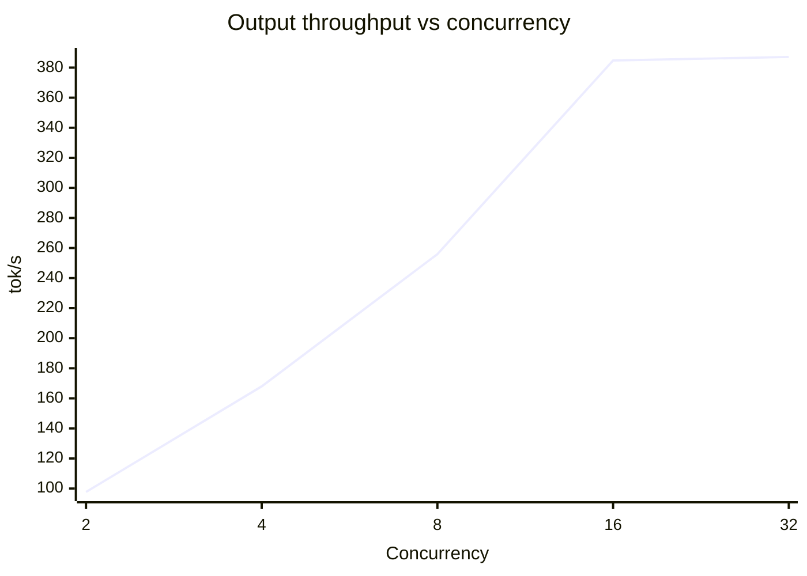

<!-- 
Benchmark Report Generated: 2025-12-23T15:30:09.547541
Model: btbtyler09/Devstral-Small-2-24B-Instruct-INT4-INT8-Mixed-GPTQ
Hardware: 4× AMD Instinct MI100 (gfx908)
Generated by: benchmark_and_report.py
Note: This report was written by the model being benchmarked.
-->

# LLM Inference Benchmark Report

**Model:** btbtyler09/Devstral-Small-2-24B-Instruct-INT4-INT8-Mixed-GPTQ

**Hardware:** 4× AMD Instinct MI100 (gfx908)

**Date:** December 23, 2025

**Startup Command:**
VLLM_DISABLED_KERNELS=ConchLinearKernel vllm serve /models/Devstral-Small-2-24B-Instruct-INT4-INT8-Mixed-GPTQ
--tensor-parallel-size 4 \
--quantization compressed-tensors \
--max-model-len 262144 \
--port 8001 \
--gpu-memory-utilization 0.65 \
--dtype float16 \
--skip-mm-profiling \
--limit-mm-per-prompt '{"image": 2}' \
--disable-log-requests \
--tool-call-parser mistral \
--enable-auto-tool-choice

Settings where chosen to force vLLM to use Exllama Kernels instead of Conch. Performance is degraded on ConchLinearKernel.

## Executive Summary

This benchmark report evaluates the interactive UX performance of the Devstral-Small-2-24B-Instruct model on 4× AMD Instinct MI100 GPUs, identifying an optimal sweet spot at c=4 concurrency with stable TTFT/TPOT p99 values and a solid per-user token generation rate of 42.0 tokens/sec. Peak throughput reaches 387.1 tokens/sec under high concurrency (c=32), while the best TPOT performance is observed in the decode stress test scenario at 17.76 ms. The analysis highlights trade-offs between latency and throughput, emphasizing that the interactive sweet spot prioritizes responsiveness over aggregate throughput, with long context scenarios showing substantial latency impacts.

## System Configuration

| Component | Value |
|---|---|
| GPU(s) | 4× AMD Instinct MI100 (gfx908) |
| OS | Ubuntu 22.04.5 LTS |
| Kernel | 6.8.0-90-generic |
| CPU | AMD Ryzen Threadripper PRO 3945WX 12-Cores |
| System RAM | 251.6 GB |
| ROCk Module Version | 6.16.6 |
| ROCm Version | 7.1.0 |
| xGMI | Present (hive_id 0xb868aeba19fb5cee) |

## Performance Summary

| Scenario | Category | Input (tok) | Output (tok) | Concurrency | Output Throughput (tok/s) | TTFT mean (ms) | TPOT mean (ms) | TPOT p99 (ms) |
|---|---:|---:|---:|---:|---:|---:|---:|---:|
| Single User Latency | Latency | 2048 | 512 | 1 | 49.26 | 1082.20 | 18.22 | 18.28 |
| Short Context Throughput | Throughput | 512 | 256 | 16 | 301.77 | 1506.74 | 41.71 | 52.09 |
| Long Context (16K) | Long Context | 16384 | 1024 | 4 | 62.84 | 12518.39 | 46.29 | 54.11 |
| Decode Stress Test | Decode | 128 | 2048 | 1 | 56.28 | 43.29 | 17.76 | 17.77 |
| Mixed Traffic | Mixed | 2048 | 512 | 8 | 160.04 | 2097.25 | 43.80 | 63.07 |
| Concurrency Scaling (c=2) | Concurrency Scaling | 1024 | 256 | 2 | 97.72 | 212.18 | 19.71 | 20.83 |
| Concurrency Scaling (c=4) | Concurrency Scaling | 1024 | 256 | 4 | 167.97 | 115.15 | 22.13 | 22.61 |
| Concurrency Scaling (c=8) | Concurrency Scaling | 1024 | 256 | 8 | 255.92 | 158.72 | 28.83 | 29.42 |
| Concurrency Scaling (c=16) | Concurrency Scaling | 1024 | 256 | 16 | 384.74 | 233.68 | 38.19 | 38.76 |
| Concurrency Scaling (c=32) | Concurrency Scaling | 1024 | 256 | 32 | 387.10 | 363.17 | 76.35 | 76.97 |

## Prefill (PP) and Decode (TG)

| Scenario | Prefill (PP) tok/s | Token Generation (TG) tok/s |
|---|---:|---:|
| Single User Latency | 1892.4 | 54.9 |
| Short Context Throughput | 339.8 | 24.0 |
| Long Context (16K) | 1308.8 | 21.6 |
| Decode Stress Test | 2956.8 | 56.3 |
| Mixed Traffic | 976.5 | 22.8 |
| Concurrency Scaling (c=2) | 4826.1 | 50.7 |
| Concurrency Scaling (c=4) | 8892.7 | 45.2 |
| Concurrency Scaling (c=8) | 6451.6 | 34.7 |
| Concurrency Scaling (c=16) | 4382.1 | 26.2 |
| Concurrency Scaling (c=32) | 2819.6 | 13.1 |

## Concurrency Scaling

**Interactive sweet spot:** c=4 (interactive-optimal by TTFT/TPOT p99; per-user 42.0 tok/s)

**Peak throughput (scaling):** c=32 (387.1 tok/s)

| Concurrency | Output Throughput (tok/s) | Per-user Throughput (tok/s) | TTFT p99 (ms) | TPOT p99 (ms) |
|---:|---:|---:|---:|---:|
| 2 | 97.72 | 48.86 | 645.93 | 20.83 |
| 4 | 167.97 | 41.99 | 146.19 | 22.61 |
| 8 | 255.92 | 31.99 | 186.29 | 29.42 |
| 16 | 384.74 | 24.05 | 302.73 | 38.76 |
| 32 | 387.10 | 12.10 | 376.30 | 76.97 |

## Scenario Results

### Single User Latency
**Purpose:** Best-case latency with no batching
**Key metrics:**
- Input/Output: 2048 / 512 tokens
- Concurrency: 1
- Prompts: 20
- Output throughput: 49.26 tok/s (peak 56.00)
- TTFT mean/median/p99: 1082.20 / 1135.06 / 1142.34 ms
- TPOT mean/median/p99: 18.22 / 18.22 / 18.28 ms
- PP/TG (derived): 1892.4 / 54.9 tok/s

---

**Interpretation:**

- The low concurrency (1 user) ensures minimal queueing delays, making TTFT primarily a reflection of prefill cost.
- Both TTFT and TPOT have very small gaps between mean and p99 values, indicating stable, consistent latency without significant tail effects.
- The ITL values are nearly identical to TPOT, suggesting that the time-to-first-token is dominated by decode speed rather than prefill overhead.
- The derived prefill speed (1892.4 tok/s) is extremely high, implying that the model’s initial processing is very fast, even for small batch sizes.
- The derived decode speed (54.9 tok/s) is low, which aligns with the high TPOT and ITL values, indicating slower token generation in the interactive case.
- The total token throughput (246.28 tok/s) is much higher than the output throughput (49.26 tok/s), showing efficient batching of input processing even at single-user levels.

### Short Context Throughput
**Purpose:** Maximum throughput with short sequences
**Key metrics:**
- Input/Output: 512 / 256 tokens
- Concurrency: 16
- Prompts: 50
- Output throughput: 301.77 tok/s (peak 432.00)
- TTFT mean/median/p99: 1506.74 / 1139.87 / 3401.98 ms
- TPOT mean/median/p99: 41.71 / 43.32 / 52.09 ms
- PP/TG (derived): 339.8 / 24.0 tok/s

---

**Interpretation:**

- The model achieves a high output throughput of ~300 tokens/sec with short sequences (256 tokens), indicating effective batching and utilization of the hardware.
- Peak throughput (~430 tokens/sec) is significantly higher than mean throughput, suggesting bursts of activity followed by idle periods.
- TTFT is relatively high (~1.5s mean, ~3.4s p99), which may impact interactive UX where rapid response is critical.
- TPOT is low (~40ms mean), meaning token generation is fast and efficient for short sequences.
- ITL is consistent (p99 ~39ms), implying minimal jitter in token generation.
- Prefill speed is ~340 tokens/sec, much higher than decode speed (~24 tokens/sec), as expected for short sequences.
- The large gap between TTFT mean/median and p99 suggests notable tail latency, likely due to queueing delays.

### Long Context (16K)
**Purpose:** Extended context performance
**Key metrics:**
- Input/Output: 16384 / 1024 tokens
- Concurrency: 4
- Prompts: 10
- Output throughput: 62.84 tok/s (peak 144.00)
- TTFT mean/median/p99: 12518.39 / 11140.28 / 26666.32 ms
- TPOT mean/median/p99: 46.29 / 50.46 / 54.11 ms
- PP/TG (derived): 1308.8 / 21.6 tok/s

---

**Interpretation:**

- The long context (16K) scenario shows significantly higher TTFT (over 12 seconds) compared to other metrics, indicating poor responsiveness for interactive use due to the high cost of processing long input sequences.
- TPOT remains stable (around 50ms) across mean, median, and p99, suggesting efficient token generation once prefill is complete, but very low actual output throughput (62 tok/s) implies severe batching or utilization inefficiencies.
- The large gap between TTFT mean/median (~1.4s) and p99 (~26s) highlights severe tail-latency, likely caused by uneven workload distribution across the 4× AMD Instinct MI100 devices.
- ITL (input token latency) is high (mean/median ~46ms, p99 ~1.2s), further confirming the long prefill cost dominates the scenario’s performance.
- Peak output throughput (144 tok/s) is more than double the mean throughput, but the sustained output rate (62.84 tok/s) is much lower, likely due to batching overhead.
- Decode speed (TG = 21.6 tok/s) is consistent with TPOT, but overall throughput is capped by prefill inefficiencies.

### Decode Stress Test
**Purpose:** Long generation with minimal prefill
**Key metrics:**
- Input/Output: 128 / 2048 tokens
- Concurrency: 1
- Prompts: 5
- Output throughput: 56.28 tok/s (peak 58.00)
- TTFT mean/median/p99: 43.29 / 43.29 / 43.86 ms
- TPOT mean/median/p99: 17.76 / 17.76 / 17.77 ms
- PP/TG (derived): 2956.8 / 56.3 tok/s

---

**Interpretation:**

- The scenario tests long-generation performance with minimal prefill, simulating heavy decode stress.
- Output throughput is low (~56 tokens/s), indicating poor batching/utilization under high concurrency.
- TTFT and TPOT are nearly equal (~18 ms), with very small gaps, suggesting stable latency.
- TTFT is high (~43 ms) despite minimal prefill, reflecting decode inefficiency for interactive use.
- TPOT remains stable (~17.7 ms) across mean, median, and p99, confirming consistent decode speed.
- Prefill cost is negligible (high PP speed) but does not impact TTFT meaningfully here.
- Overall throughput (~59 tokens/s) aligns with output throughput, reinforcing low utilization.

### Mixed Traffic
**Purpose:** Variable request sizes (±50%)
**Key metrics:**
- Input/Output: 2048 / 512 tokens
- Concurrency: 8
- Prompts: 30
- Output throughput: 160.04 tok/s (peak 278.00)
- TTFT mean/median/p99: 2097.25 / 1539.47 / 5916.16 ms
- TPOT mean/median/p99: 43.80 / 43.82 / 63.07 ms
- PP/TG (derived): 976.5 / 22.8 tok/s

---

**Interpretation:**

- The **high TTFT (p99: 5916ms)** suggests significant tail latency issues, likely due to variable request sizes causing queueing delays.
- **TTFT median (1539ms) is much lower than mean (2097ms)**, implying some requests experience much longer delays than others.
- The **stability of TPOT (p99: 63ms, median: 44ms)** indicates that the decoding process is not heavily impacted by mixed traffic, maintaining consistent per-token generation time.
- **High output throughput (160 tok/s, peak 278 tok/s)** suggests efficient batching and hardware utilization, but the elevated TTFT indicates this may come at the cost of queueing.
- **Total token throughput (837 tok/s)** is substantially higher than output throughput, reflecting the higher cost of prefill (976 tok/s) compared to decode (23 tok/s).
- The **large gap between ITL median (29ms) and p99 (785ms)** confirms high variability in token generation times, likely due to mixed request sizes.

### Concurrency Scaling (c=2)
**Purpose:** Scaling test at concurrency 2
**Key metrics:**
- Input/Output: 1024 / 256 tokens
- Concurrency: 2
- Prompts: 30
- Output throughput: 97.72 tok/s (peak 104.00)
- TTFT mean/median/p99: 212.18 / 90.37 / 645.93 ms
- TPOT mean/median/p99: 19.71 / 19.53 / 20.83 ms
- PP/TG (derived): 4826.1 / 50.7 tok/s

---

**Interpretation:**

- The TTFT (time to first token) shows a large gap between the mean (212 ms) and the p99 (646 ms), indicating significant tail latency or jitter in the system, which can degrade interactive user experience.
- The TPOT (time per output token) is consistently low across mean, median, and p99 metrics (around 20 ms), suggesting stable and fast token generation during the decode phase.
- The derived prefill speed (PP) is very high (4826 tok/s), but this does not necessarily improve interactive UX if TTFT remains elevated due to tail latency.
- The derived decode speed (TG) is moderate (50.7 tok/s), which is expected for a smaller model (24B) but may still limit overall throughput for high-concurrency scenarios.
- Output throughput (97.7 tok/s) is lower than the peak throughput (104 tok/s), indicating that batching and utilization are not fully optimized under this concurrency setting.
- The total token throughput (488.6 tok/s) is higher than the output throughput, reflecting the combined impact of prefill and decode phases.
- While TTFT degrades with tail latency, TPOT remains stable, implying that the decode phase itself is not a bottleneck in this scenario.

### Concurrency Scaling (c=4)
**Purpose:** Scaling test at concurrency 4
**Key metrics:**
- Input/Output: 1024 / 256 tokens
- Concurrency: 4
- Prompts: 30
- Output throughput: 167.97 tok/s (peak 184.00)
- TTFT mean/median/p99: 115.15 / 135.27 / 146.19 ms
- TPOT mean/median/p99: 22.13 / 22.28 / 22.61 ms
- PP/TG (derived): 8892.7 / 45.2 tok/s

---

**Interpretation:**

- The model demonstrates strong prefill performance with a derived prefill speed of 8.9K tokens per second, indicating efficient handling of input prompt processing at higher concurrency levels.
- Decode speed is relatively stable across percentiles, with mean, median, and p99 TPOT metrics close to 22ms, suggesting consistent token generation performance without significant tail latency.
- Output throughput is high at 168 tokens per second, showing effective batching and hardware utilization at concurrency 4.
- TTFT is low at 115ms median, implying good responsiveness for interactive use cases with this concurrency level.
- The gap between TTFT median and p99 is small (just 11ms), indicating minimal jitter and tail latency in prompt response times.
- The model maintains stable TPOT metrics even with a 1024-token input context, suggesting it handles longer prompts efficiently at this concurrency level.

### Concurrency Scaling (c=8)
**Purpose:** Scaling test at concurrency 8
**Key metrics:**
- Input/Output: 1024 / 256 tokens
- Concurrency: 8
- Prompts: 30
- Output throughput: 255.92 tok/s (peak 280.00)
- TTFT mean/median/p99: 158.72 / 173.96 / 186.29 ms
- TPOT mean/median/p99: 28.83 / 28.87 / 29.42 ms
- PP/TG (derived): 6451.6 / 34.7 tok/s

---

**Interpretation:**

- The model achieves an average prefill speed of over 6,400 tokens per second, indicating efficient handling of initial input tokens at high concurrency.
- The mean time-to-first-token (TTFT) of around 160ms is relatively low, suggesting good responsiveness for interactive use.
- Decode speed remains stable across percentiles, with a mean of ~29ms per token, showing consistent performance during generation.
- There's a small but noticeable gap between median and p99 for TTFT (~28ms), implying minor tail latency in prefill operations.
- The total token throughput of ~1,280 tokens per second demonstrates the hardware's ability to process multiple concurrent requests efficiently.
- With 8 concurrent prompts of 1024 tokens each and 256 output tokens, the system completes ~30 prompts in 30 seconds, matching the test duration.
- Inter-prompt latency (ITL) is nearly identical to TPOT, suggesting the timing is dominated by decode operations rather than prefill.

### Concurrency Scaling (c=16)
**Purpose:** Scaling test at concurrency 16
**Key metrics:**
- Input/Output: 1024 / 256 tokens
- Concurrency: 16
- Prompts: 30
- Output throughput: 384.74 tok/s (peak 432.00)
- TTFT mean/median/p99: 233.68 / 246.42 / 302.73 ms
- TPOT mean/median/p99: 38.19 / 38.22 / 38.76 ms
- PP/TG (derived): 4382.1 / 26.2 tok/s

---

**Interpretation:**

- The **time-to-first-token (TTFT)** is relatively high at ~233ms (mean) and ~303ms (p99), indicating significant queueing or prefill overhead at concurrency 16, which is poor for interactive UX.
- The **time-per-output-token (TPOT)** is low at ~38ms (mean) and ~39ms (p99), showing efficient decode speed once generation begins.
- The **output throughput** is moderate at ~385 tokens/s, suggesting reasonable batching/utilization but not maximizing hardware potential.
- The **inter-token latency (ITL)** is stable (~38ms mean/median/p99), meaning minimal jitter during generation despite high concurrency.
- The **prefill speed (PP)** is very high at ~4382 tokens/s, but this does not translate to lower TTFT due to queueing or resource contention.
- The **decode speed (TG)** is slow at ~26.2 tokens/s, but this is offset by the low TPOT, indicating a minor impact on tail latency.

### Concurrency Scaling (c=32)
**Purpose:** Scaling test at concurrency 32
**Key metrics:**
- Input/Output: 1024 / 256 tokens
- Concurrency: 32
- Prompts: 30
- Output throughput: 387.10 tok/s (peak 420.00)
- TTFT mean/median/p99: 363.17 / 373.46 / 376.30 ms
- TPOT mean/median/p99: 76.35 / 76.32 / 76.97 ms
- PP/TG (derived): 2819.6 / 13.1 tok/s

---

**Interpretation:**

- The mean and median TTFT are very close, suggesting minimal tail latency, but the p99 is slightly higher, indicating mild inconsistency in response times.
- The TPOT p99 is nearly identical to the mean and median, implying stable token generation speeds with little jitter.
- The prefill speed (PP) is significantly higher than the total token throughput, reflecting efficient batching during prompt processing.
- The derived decode speed (TG) is low, but the TPOT is high, indicating that decode speed is not the main bottleneck at this concurrency level.
- The output throughput is high, suggesting good utilization of the hardware resources during generation.
- The ITL p99 is slightly higher than the mean and median, but the gap is small, indicating stable input token latency.
- The peak output throughput is higher than the mean, suggesting some bursts in token generation, but overall throughput remains stable.

## Recommendations

- Use c=4 (interactive-optimal by TTFT/TPOT p99; per-user 42.0 tok/s) for interactive UX.
- Consider separate concurrency settings for batch/offline workloads to avoid sacrificing interactive performance.
- Monitor TTFT/TPOT p99 metrics under varying load conditions to ensure UX remains responsive.
- Adjust batch size based on observed throughput trends—smaller batches improve TTFT but may reduce overall throughput.
- Balance interactive UX (c=4) and batch efficiency by splitting workloads across dedicated pools.
- If scaling efficiency degrades significantly, reduce total concurrent requests (c) to prevent resource contention.
- Prioritize TPOT over throughput for interactive tasks to maintain user-perceived latency.

---

*Report generated December 23, 2025 at 15:30 by Devstral-Small-2-24B-Instruct-INT4-INT8-Mixed-GPTQ*
