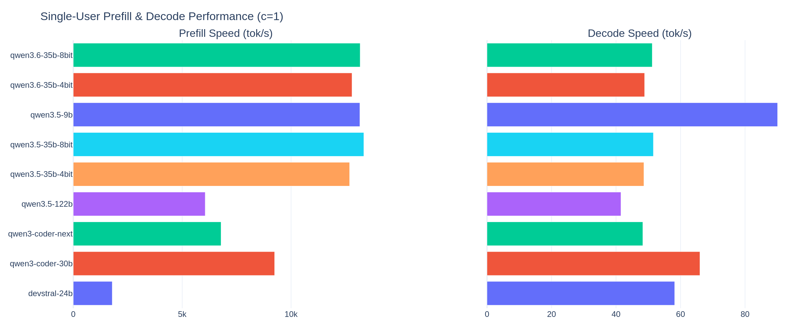
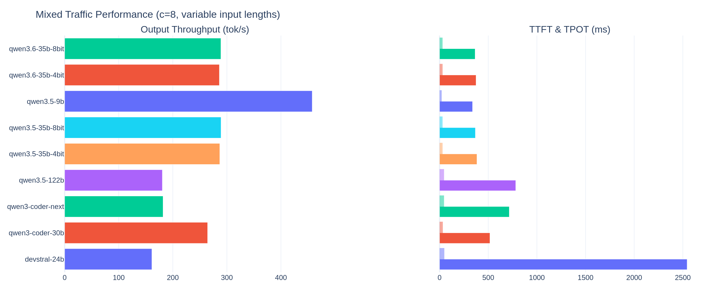
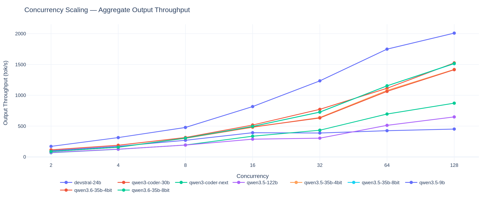
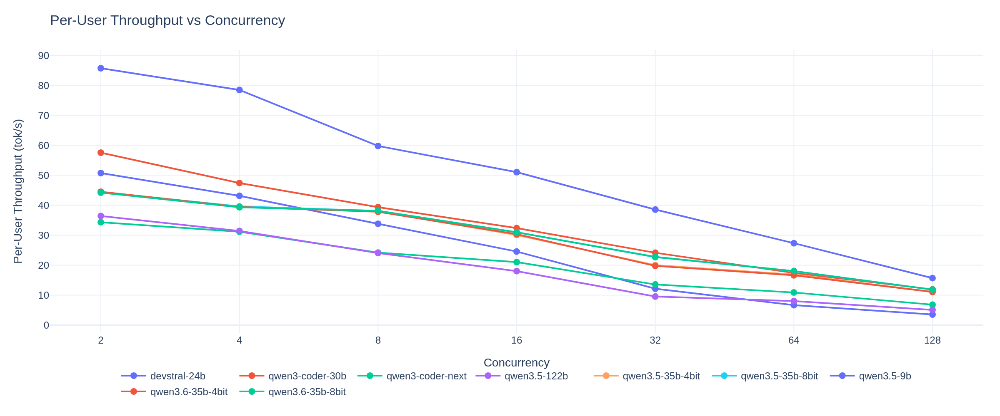

# mi100-llm-testing
This is a repository for documenting the setup and performance of MI100s in popular inference engines.

# vLLM

vLLM officially supports MI200 and MI300 series GPUs, but older cards like the MI100 (gfx908) are not officially supported. With some modifications it is possible to run vLLM on these GPUs. The MI100 lacks FP8/FP4 hardware and is incompatible with Composable Kernel (CK) ops, but Triton-based kernels work well.

**4/20/2026 Update — v0.19 benchmark refresh**
* All models rebenchmarked on vLLM v0.19.2rc1+mi100 with ROCm 7.2.1.
* Attention backend: `--attention-backend TRITON_ATTN` (stable on gfx908).
* Compile + piecewise CUDA graphs enabled for improved decode throughput.
* New reports are under `Model_Reports/` with the `_v0.19_triton` suffix.

**3/11/2026 Update**
* vLLM v0.16.1 with AITER (AMD Inference and Training Extension for ROCm) support for gfx908.
* AITER provides Triton-based RoPE and attention kernels. CK-based ops (GEMM, MoE, Flash Attention, norms) are disabled on gfx908 since CK uses gfx90a+ instructions.
* Only one env var needed: `VLLM_ROCM_USE_AITER=1`. All other AITER flags are auto-configured for gfx908.
* ROCm 7.0, PyTorch 2.9.1, Triton 3.4.0.
* Tested with GPTQ quantized models (4-bit and 8-bit). Recommended quant providers on HuggingFace: jart25, QuantTrio, cpatonn.

**Known issues:**
* AITER Unified Attention is disabled on gfx908 — it corrupts model state after ~200+ sustained requests, causing degenerate repetitive output. The default Triton Attention backend is stable and performance-equivalent.
* GPTQ models require `--dtype half` (float16). bfloat16 will cause errors.
* `HSA_OVERRIDE_GFX_VERSION` is no longer needed with native gfx908 support.

## Pull the prebuilt container from Docker Hub

```bash
docker pull btbtyler09/vllm-rocm-gfx908:v0.16.1.dev
```

Start a container with GPU access:
* Specify render devices for your GPUs (renderD128 = GPU 0, incrementing from there).
* Mount your HuggingFace cache to avoid re-downloading models.
* `VLLM_ROCM_USE_AITER=1` enables AITER's Triton-based kernels for gfx908. All other AITER flags are auto-configured — CK ops, FP8/FP4, and Unified Attention are automatically disabled, while Triton RoPE is enabled. No other env vars are needed.

```bash
docker run -it \
  --network=host \
  --group-add=video \
  --ipc=host \
  --cap-add=SYS_PTRACE \
  --security-opt seccomp=unconfined \
  --device=/dev/kfd \
  --device=/dev/dri/renderD128 \
  --device=/dev/dri/renderD129 \
  --device=/dev/dri/renderD130 \
  --device=/dev/dri/renderD131 \
  --env VLLM_USE_V1=1 \
  --env VLLM_ROCM_USE_AITER=1 \
  --env HF_HOME=/huggingface \
  -v /home/{user}/.cache/huggingface:/huggingface \
  btbtyler09/vllm-rocm-gfx908:v0.16.1.dev \
  bash
```

Run a model:
```bash
vllm serve Qwen/Qwen3.5-35B-A3B-GPTQ-4bit \
  --gpu-memory-utilization 0.75 \
  --max-model-len 32768 \
  --tensor-parallel-size 4 \
  --dtype half \
  --quantization gptq \
  --disable-log-requests \
  --trust-remote-code
```
* `tensor-parallel-size` should match your GPU count (1, 2, or 4).
* `max-model-len` can be increased if you have memory headroom, or decreased for single-GPU setups.
* `gpu-memory-utilization` controls how much VRAM vLLM reserves (0.75 is conservative, 0.95+ for max context).

## Build from source

1. Pull the git repos for vLLM and AITER
2. Build the AITER MI100 image (includes ROCm 7.0, PyTorch, Triton):
```bash
cd aiter
DOCKER_BUILDKIT=1 docker build \
  -f Dockerfile.mi100 \
  -t aiter-mi100:latest .
```
3. Build the vLLM container on top of it:
```bash
cd vllm
DOCKER_BUILDKIT=1 docker build \
  --build-arg BASE_IMAGE=aiter-mi100:latest \
  -f docker/Dockerfile.mi100 \
  -t vllm-rocm-gfx908:latest .
```

## Benchmark Results

Performance benchmarks for quantized models running on 4x AMD Instinct MI100 GPUs (gfx908) via vLLM v0.19.2rc1+mi100 with AITER (TRITON_ATTN, compile+piecewise). Full interactive charts with legend toggle are available in the [interactive dashboard](charts/benchmark_charts.html). Detailed per-model reports are in [`Model_Reports/`](Model_Reports/).

### Single-User Prefill & Decode (c=1)


### Mixed Traffic (c=8, variable input lengths)


### Concurrency Scaling


### Per-User Throughput vs Concurrency


**Models tested:** Qwen3.5-9B, Devstral-Small-2-24B (Mixed-GPTQ), Qwen3-Coder-30B-A3B (GPTQ-4bit), Qwen3.5-35B-A3B (GPTQ-4bit, GPTQ-8bit), Qwen3.6-35B-A3B (GPTQ-4bit, GPTQ-8bit), Qwen3-Coder-Next (GPTQ-4bit), Qwen3.5-122B-A10B (GPTQ-4bit)

To regenerate charts after running new benchmarks:
```bash
python generate_charts.py
```

## Supported Quantizations

GPTQ quantization works well in 4-bit and 8-bit. AWQ is also supported. GGUF models are not supported by vLLM on ROCm.

Pre-quantized models on HuggingFace:
* [btbtyler09/Llama-3.1-8B-Instruct-gptq-4bit](https://huggingface.co/btbtyler09/Llama-3.1-8B-Instruct-gptq-4bit)

## Docker Hub Tags

| Tag | vLLM Version | AITER | Notes |
|-----|-------------|-------|-------|
| `v0.16.1.dev` | 0.16.1.dev | Yes | **Latest** — AITER Triton ops, UA-OFF fix |
| `v0.15.2rc1.dev-aiter` | 0.15.2rc1.dev | Yes | Older, first AITER integration |
| `v0.15.2rc1.dev` | 0.15.2rc1.dev | No | Pre-AITER, Triton Flash Attention only |
